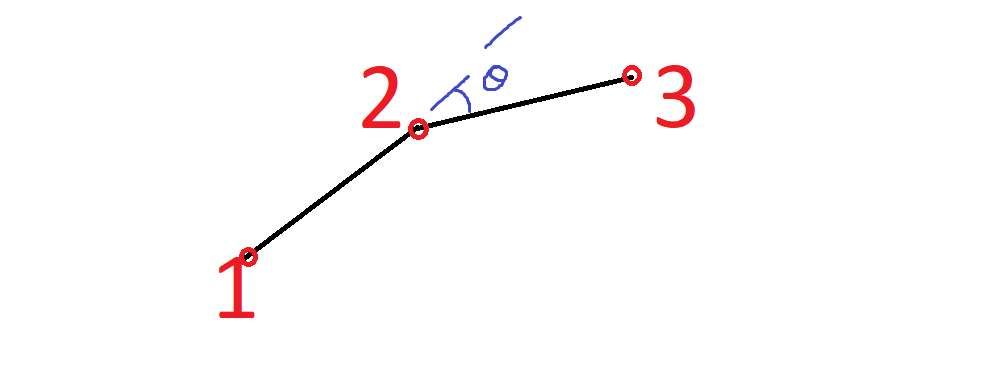

# GIC-Track
This dashboard is designed for the spatial and temporal analysis of fluorescently tagged transcription factors within cell nuclei.

# Installation Guide
1. Download Python from https://www.python.org/ftp/python/3.10.5/python-3.10.5-amd64.exe.
2. Run the Python installer file. Make sure to tick the “Add Python 3.10 to PATH” as shown in figure below before selecting “Install Now”. 

  

3. Once finished, run the “Requirements.bat” attached to install the required Python libraries.

# Requirement
This dashboard requires MATLAB with Statictics and Curve Fitting toolbox installed.

# Dashboard Usage
The dashboard would classify the files uploaded based on the naming convention; with the string/text before the first "_" being used as condition type to group the file/cell data.
Below are some example of the file name convention for comparing between 2 conditions of 3 files each:  
Condition-1_Cell_1.tiff  
Condition-1_Cell_2.tiff  
Condition-1_Cell_3.tiff  
Condition-2_Cell_1.tiff  
Condition-2_Cell_2.tiff  
Condition-2_Cell_3.tiff  

# Data Table Format
## FileList
| Parameter | Type | Description |
| --- | --- | --- |
| filename | TEXT | The filename that contribute to the dataset. |
| mutation | TEXT | The condition of the file/cell data, created based on file naming convention. |
| acquisition_rate | TEXT | "fast" or "slow", used to differentiate the data acquisition rate to prevent mixing of data types. |
| exposure_time | REAL| Exposure time in ms. |
| pixelSize | REAL | Pixel size of the data (in &mu;m). |
| cellSize | REAL | The size of the cell/nucleus based on segmented data (in pixels). |
| psfScale | REAL | - |
| wvlngth | REAL | - |
| iNA | REAL | - |
| psfStd | REAL | - |
| wn | REAL | - |
| errorRate | REAL | - |
| dfltnLoops | REAL | - |
| minInt | REAL | - |
| maxOptimIter | REAL | - |
| termTol | REAL | - |
| isRadiusTol | INTEGER | - |
| radiusTol | REAL | - |
| posTol | REAL | - |
| optim_termTol | REAL | - |
| optim_radTol | REAL | - |
| optim_radTol | REAL | - |
| optim_posTol | REAL | - |
| isThreshLocPrec | INTEGER | - |
| minLoc | REAL | - |
| maxLoc | REAL | - |
| isThreshSNR | INTEGER | - |
| minSNR | REAL | - |
| maxSNR | REAL | - |
| isThreshDensity | INTEGER | - |
| trackStart | REAL | - |
| trackEnd | REAL | - |
| Dmax | REAL | - |
| searchExpFac | REAL | - |
| statWin | REAL | - |
| maxComp | REAL | - |
| maxOffTime | REAL | - |
| intLawWeight | REAL | - |
| diffLawWeight | REAL | - |
| bleach_rate | REAL | - |
| traj_length | INTEGER | - |
| min_traj | INTEGER | - |
| clip_factor | INTEGER | - |
| tol | INTEGER | - |
| twoParN | REAL | - |
| twoPardN | REAL | - |
| twoParD1 | REAL | - |
| twoPardD1 | REAL | - |
| twoParD2 | REAL | - |
| twoPardD2 | REAL | - |
| twoParf1 | REAL | - |
| twoPardf1 | REAL | - |
| twoParSSR | REAL | - |
| twoParN | REAL | - |
| twoPardN | REAL | - |
| threeParD1 | REAL | - |
| threePardD1 | REAL | - |
| threeParD2 | REAL | - |
| threePardD2 | REAL | - |
| threeParD3 | REAL | - |
| threePardD3 | REAL | - |
| threeParf1 | REAL | - |
| threePardf1 | REAL | - |
| threeParf2 | REAL | - |
| threePardf2 | REAL | - |
| threeParSSR | REAL | - |

## TrajectoryList
| Parameter | Type | Description |
| --- | --- | --- |
| filename | TEXT | The filename that contribute to the dataset. |
| trajID | TEXT | The ID used to identify this trajectory. |
| traj_length | INTEGER | The total number of frames this trajectory existed. |
| msd | REAL | - |
| D | REAL | The diffusion coefficient of the trajectory (in Log10(&mu;m2)). |
| startTime | REAL | The time stamp the trajectory first appear. |
| endTime | REAL | The time stamp the trajectory is last seen. |
| meanX | REAL | The mean X-coordinate of the trajectory. |
| meanY | REAL | The mean Y-coordinate of the trajectory. |
| maxDistance | REAL | The maximum distance a track (that's belong to this trajectory) travelled. |
| meanDistance | REAL | The mean distance a track (that's belong to this trajectory) travelled. |
| medianDistance | REAL | The median distance a track (that's belong to this trajectory) travelled. |

## TrackList
| Parameter | Type | Description |
| --- | --- | --- |
| trajID | TEXT | The ID used to identify this trajectory. |
| Frame | REAL | The time the track is being observed (computed from the frame number it's being detected in and "exposure time"). |
| x | REAL | The X-coordinate of the track at "Frame". |
| y | REAL | The Y-coordinate of the track at "Frame". |
| msd | REAL | The mean square displacement of the tracj with respect to its previous position (in the previous "Frame"). |
| distance | REAL | The distance this track moved with respect to its previous position (in the previous "Frame"). |
| angle | REAL | The angle between the track at "Frame" with respect to its two previous position. |

The angle is calculated by its “diversion” from the previous track (how many degree it branched from previous movement [refer to the Figure below, where the track was moving from “1” to “2” in the first frame and “diverted” to “3” at second frame with the angle theta calculated as shown in the Figure]).
Note that the angle diversion do not account for whether it's clockwise or anti-clockwise diversion.

  

## AngleList
| Parameter | Type | Description |
| --- | --- | --- |
| filename | TEXT | The filename that contribute to the dataset. |
| trajID | TEXT | The ID used to identify this trajectory. |
| A1 | INTEGER | Number of angles with tracks between 0 - 10° in this trajectory. |
| A2 | INTEGER | Number of angles with tracks between 10 - 20° in this trajectory. |
| A3 | INTEGER | Number of angles with tracks between 20 - 30° in this trajectory. |
| A4 | INTEGER | Number of angles with tracks between 30 - 40° in this trajectory. |
| A5 | INTEGER | Number of angles with tracks between 40 - 50° in this trajectory. |
| A6 | INTEGER | Number of angles with tracks between 50 - 60° in this trajectory. |
| A7 | INTEGER | Number of angles with tracks between 60 - 70° in this trajectory. |
| A8 | INTEGER | Number of angles with tracks between 70 - 80° in this trajectory. |
| A9 | INTEGER | Number of angles with tracks between 80 - 90° in this trajectory. |
| A10 | INTEGER | Number of angles with tracks between 90 - 100° in this trajectory. |
| A11 | INTEGER | Number of angles with tracks between 100 - 110° in this trajectory. |
| A12 | INTEGER | Number of angles with tracks between 110 - 120° in this trajectory. |
| A13 | INTEGER | Number of angles with tracks between 120 - 130° in this trajectory. |
| A14 | INTEGER | Number of angles with tracks between 130 - 140° in this trajectory. |
| A15 | INTEGER | Number of angles with tracks between 140 - 150° in this trajectory. |
| A16 | INTEGER | Number of angles with tracks between 150 - 160° in this trajectory. |
| A17 | INTEGER | Number of angles with tracks between 160 - 170° in this trajectory. |
| A18 | INTEGER | Number of angles with tracks between 170 - 180° in this trajectory. |

## JDList
| Parameter | Type | Description |
| --- | --- | --- |
| filename | TEXT | The filename that contribute to the dataset. |
| jump_distance | REAL | - |
| sharedFrequency | REAL | - |
| twoParFrequency | REAL | - |
| threeParFrequency | REAL | - |
| twoParD1Values | REAL | - |
| twoParD2Values | REAL | - |
| threeParD1Values | REAL | - |
| threeParD2Values | REAL | - |
| threeParD3Values | REAL | - |
